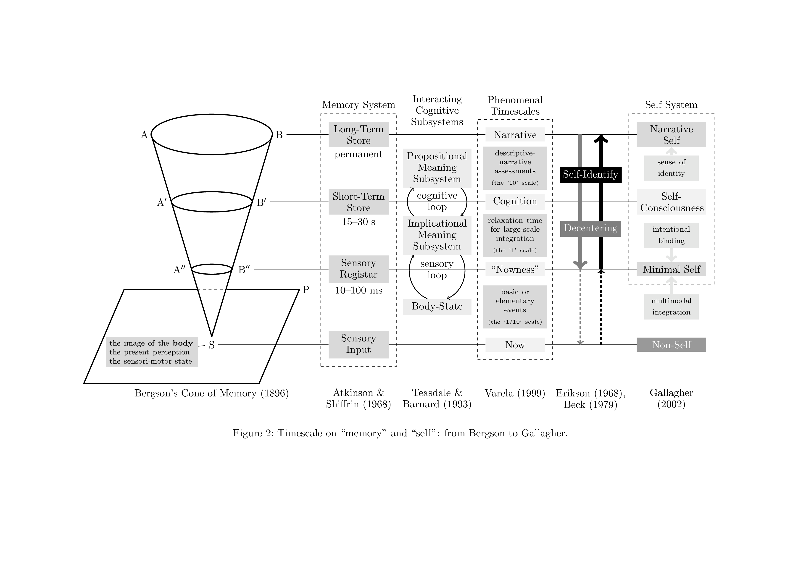
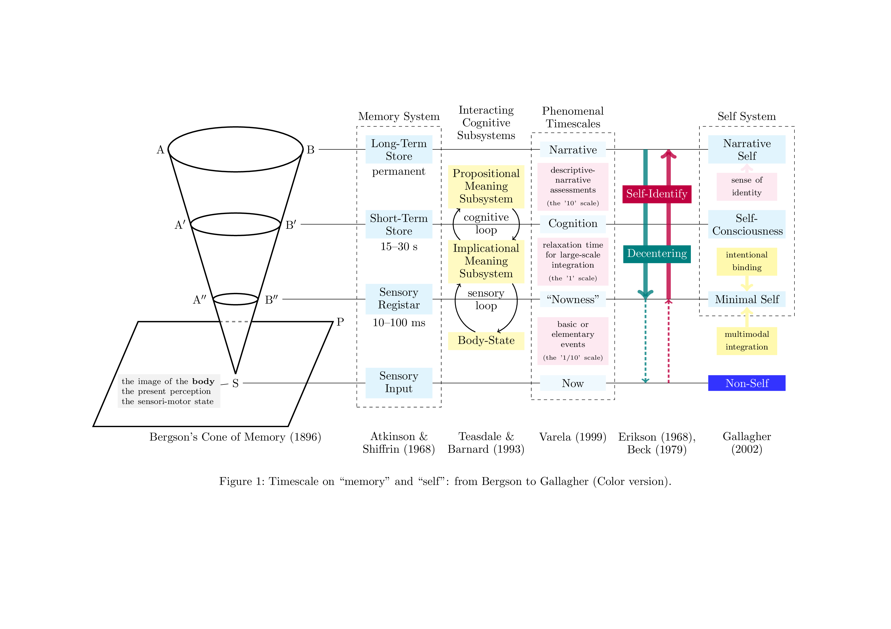

# Perspective from Bergson

[English](#english) | [日本語](#japanese)

## English

### Overview

This repository provides the source code and variations of Figure 2 from:

Muta, Toshizumi and Kikai, Tomoki (2021). Embodiment in mindfulness, *Japanese Psychological Review*, 2021, Volume 64, Issue 3, Pages 318-343.

DOI: https://doi.org/10.24602/sjpr.64.3_318

### Preview





### Description

Available Materials:
- Original figure as published (grayscale version)
- Enhanced color version

This figure integratively represents multiple theoretical frameworks based on temporal homology:

- Bergson's cone diagram (Bergson, 1896)
- Dual storage model of memory (Atkinson & Shiffrin, 1968)
- Cognitive interaction subsystem (ICS; Teasdale & Barnard, 1993)
- Neurophenomenological time scale theory (Varela, 1997, 1999)
- Self-awareness theory based on time scale theory (Gallagher, 2000)

The figure also incorporates:
- Decentering (Beck, 1979)
- Self-identification (Erikson, 1968)
- Non-self

### Usage

Prerequisites:
- TeX environment (e.g., TeXLive)
- Required packages:
  - tikz
  - amssymb
  - amsmath

#### Compilation

```bash
cd src
pdflatex figure2.tex
```

The output PDF contains both versions of the figure with corresponding captions.

## Japanese

### 概要

本リポジトリは以下の論文のFigure 2のソースコードおよび派生図を提供しています：

牟田季純・木甲斐智紀（2021） マインドフルネスにおける身体性 *心理学評論*, *64*(3), pp.318-343.

DOI: https://doi.org/10.24602/sjpr.64.3_318

### 内容

提供内容：
- 論文掲載版（モノクロ）のソースコード
- カラー版のソースコード

本図は、以下の理論的枠組みを時間的相同性に基づいて統合的に表現したものです：

- ベルクソンの円錐図（Bergson, 1896）
- 記憶の二重貯蔵モデル（Atkinson & Shiffrin, 1968）
- 認知的相互作用サブシステム（ICS; Teasdale & Barnard, 1993）
- 神経現象学的なタイムスケール論（Varela, 1997, 1999）
- タイムスケール論に基づく自己意識理論（Gallagher, 2000）

また、以下の概念も図中に統合されています：
- 脱中心化（Beck, 1979）
- 自己同一化（Erikson, 1968）
- 無我

### 使用方法

必要環境：
- TeX実行環境（TeXLiveなど）
- 必要パッケージ：
  - tikz
  - amssymb
  - amsmath

#### コンパイル方法

```bash
cd src
pdflatex figure2.tex
```

生成されるPDFには、両バージョンの図とそれぞれの説明が含まれます。

## Support / サポートについて

本プロジェクトは個人の研究・教育活動の一環として公開しています。

作者は別途、心理学の教育・研究を支援する個人事業「[サイコロスタジオ (Psycholo Studio)](https://psycholo.studio)」を運営しています。心理学の教育・研究活動全般へのサポートをご検討いただける場合は、以下のリンクからご寄付いただけます：

This project is published as part of the author's individual research and educational activities.

The author also runs [Psycholo Studio](https://psycholo.studio), a personal business supporting psychology education and research. If you're interested in supporting psychology education and research activities in general, you can make a donation through the following link:

[ Support Psycholo Studio / サイコロスタジオを支援する](https://donate.stripe.com/00g02EgDrdnsb724gk)


頂戴したご支援は、以下の心理学教育・研究活動に活用させていただきます：
- 心理学の教育コンテンツの開発
- 研究資料・教材の制作
- オープンソースプロジェクトの維持・発展

Your support will help us with psychology education and research activities such as:
- Developing psychology education content
- Creating research materials and teaching resources
- Maintaining and expanding open-source projects

## Citation / 引用について

本図を研究や出版物で使用される場合は、以下のいずれかの形式で引用をお願いいたします：
When using this figure in research or publications, please cite using one of the following formats:

### APA Style / APA形式
Muta, T., & Kikai, T. (2021). Embodiment in mindfulness. Japanese Psychological Review, 64(3), 318-343. https://doi.org/10.24602/sjpr.64.3_318

### Japanese Citation Style / 日本語の引用形式
牟田季純・木甲斐智紀 (2021). マインドフルネスにおける身体性 心理学評論, 64(3), 318-343. https://doi.org/10.24602/sjpr.64.3_318

### BibTeX
```bibtex
@article{mutakikai2021embodiment,
  title={Embodiment in mindfulness},
  author={Muta, Toshizumi and Kikai, Tomoki},
  journal={Japanese Psychological Review},
  volume={64},
  number={3},
  pages={318--343},
  year={2021},
  doi={10.24602/sjpr.64.3_318}
}
```

## References / 参考文献

- Atkinson, R. C., & Shiffrin, R. M. (1968). Human memory: A proposed system and its control processes. *Psychology of Learning and Motivation, 2*, 89-195.
- Beck, A. T. (1979). *Cognitive therapy of depression*. Guilford press.
- Bergson, H. (1896). *Matière et Mémoire: Essai Sur la Relation du Corps à L'esprit.* Ligaran Éditions.
- Erikson, E. H. (1968). *Identity: Youth and crisis*. Norton & Company.
- Gallagher, S. (2000). Philosophical conceptions of the self: Implications for cognitive science. *Trends in Cognitive Sciences, 4*(1), 14-21.
- Teasdale, J. D., & Barnard, P. J. (1993). *Affect, cognition, and change: Re-modelling depressive thought*. Lawrence Erlbaum Associates.
- Varela, F. J. (1997). The specious present: A neurophenomenology of time consciousness. *Naturalizing phenomenology: Issues in contemporary phenomenology and cognitive science*, 266-314.
- Varela, F. J. (1999). Present-time consciousness. *Journal of Consciousness Studies, 6*(2-3), 111-140.

## License / ライセンス

本プロジェクトはMITライセンスに基づいて公開されています。詳細は [LICENSE](LICENSE) ファイルをご参照ください。

This project is published under the MIT License. Please refer to the [LICENSE](LICENSE) file for details.